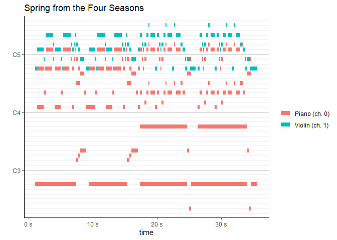

<!-- README.md is generated from README.Rmd. Please edit that file -->

# midi

JUST A DRAFT\!\!\!

This is a rewrite of `TuneR::readMidi()`, with a counterpart to write
midi.

We don’t create a data.frame but a R6 object.

It’s still very brittle and changes frequently significantly.

I’d like to be able to change scales/modes, apply arpeggios etc, maybe
do some analysis on big amounts of midi files to detect patterns in
styles of music or specific artists, but we’re far from there.

I’d like to do something similar with guitar pro files too as their
structure is more suited to songwriting and the gp5 file format has been
reverse engineered.

## Installation

Install with:

``` r
remotes::install_github("moodymudskipper/midi")
```

## Example

Load a simple music file with 2 instruments (that’s 3 tracks here)

``` r
library(midi)

mid <- midi$new("https://www.8notes.com/school/midi/violin/vivaldi_spring.mid")

# it prints nicely
mid
#> header:
#> # A tibble: 1 x 3
#>   format n_tracks n_ticks_per_quarter_note
#>    <int>    <int>                    <int>
#> 1      1        3                      960
#> tracks:
#> $`Spring from the Four Seasons`
#> # A tibble: 7 x 4
#>    time channel event
#>   <dbl>   <int> <chr>
#> 1     0      NA Time~
#> 2     0      NA Key ~
#> 3     0      NA Sequ~
#> 4     0      NA Text~
#> 5  2880      NA Set ~
#> 6 99840      NA Time~
#> 7 99841      NA End ~
#> # ... with 1 more variable: params <mid_prms>
#> 
#> $Violin
#> # A tibble: 204 x 4
#>     time channel event                                                    params
#>    <dbl>   <int> <chr>                                                <mid_prms>
#>  1  2880       1 Program Change                                               40
#>  2  2880       1 Control Change: Reset All Controllers                         0
#>  3  2880       1 Control Change: Damper pedal on/off (~                        0
#>  4  2880       1 Control Change: Effects 1 Depth                              42
#>  5  2880       1 Control Change: Pan                                          38
#>  6  2880       1 Control Change: Channel Volume                              115
#>  7  2880      NA Sequence/Track Name                                      Violin
#>  8  2880       1 Note On                                  a4 (69), velocity:  84
#>  9  3743       1 Note Off                                 a4 (69), velocity:   0
#> 10  3840       1 Note On                                 c#5 (73), velocity: 105
#> # ... with 194 more rows
#> 
#> $Piano
#> # A tibble: 597 x 4
#>     time channel event                                                    params
#>    <dbl>   <int> <chr>                                                <mid_prms>
#>  1  2880       0 Program Change                                                0
#>  2  2880       0 Control Change: Reset All Controllers                         0
#>  3  2880       0 Control Change: Damper pedal on/off (S~                       0
#>  4  2880       0 Control Change: Effects 1 Depth                              48
#>  5  2880       0 Control Change: Pan                                          51
#>  6  2880       0 Control Change: Channel Volume                              100
#>  7  2880       0 Note On                                  a4 (69), velocity:  92
#>  8  2880       0 Control Change: Reset All Controllers                         0
#>  9  2880       0 Control Change: Damper pedal on/off (S~                       0
#> 10  2880       0 Control Change: Effects 1 Depth                              48
#> # ... with 587 more rows

# we can show separately header or tracks
mid$header
#> # A tibble: 1 x 3
#>   format n_tracks n_ticks_per_quarter_note
#>    <int>    <int>                    <int>
#> 1      1        3                      960

# print names, tempo, key
mid$names
#> [1] "Spring from the Four Seasons" "Violin"                      
#> [3] "Piano"
mid$tempo
#> # A tibble: 1 x 2
#>     bpm micro_seconds_per_quarter_note
#>   <dbl>                          <int>
#> 1  180.                         333333

# plot
mid$plot()
```



``` r

# re-encode to midi
local_file <- tempfile(fileext = ".mid")
mid$encode(local_file)

# and reimport to check if our back and forth transformation was reliable
mid_reimported <- midi$new(local_file)
all.equal(mid, mid_reimported)
#> [1] TRUE
```

We can play one track or two in stereo, this is done by converting to
wave, directly inspired by David Solito’s work (see
<https://www.davidsolito.com/post/midiplayer-avec-r-part-2/> ).

``` r
mid$play("Piano","Violin")
```

We can also use `$cut()` to restrict the song to a time window,
`$rename()` and `$select()` to manipulate tracks, `$set_tempo()` to
assign a tempo, `$shift_hstep()`to move all notes of chosen tracks by
half steps or `$shift_degree` to shift chosen tracks by a chosen
interval on a chosen scale.

These modifications don’t produce yet an obejct that one can re-encode
back to midi, but we can already use our `$play()` method on them.

Harmonize Vivaldi :

``` r
vivaldi_mid$
  # select Violin track twice (i.e. subset and duplicate)
  select(Violin1=Violin, Violin3=Violin)$
  # shift all notes by 2 intervals in A maj so Violin3 is the third of Violin1
  shift_degree(2, scale_major("a"), at = Violin3)$
  # mix and play
  play("Violin","Violin3")
```
